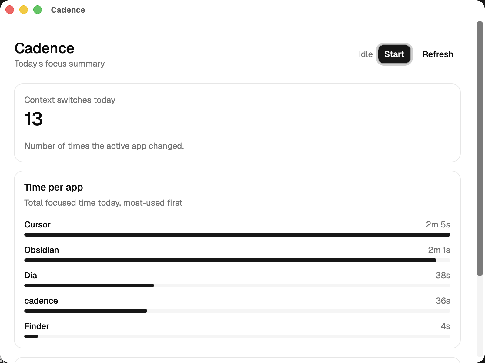

# Cadence

A local-first developer telemetry dashboard. Cadence quietly observes your coding rhythm - active window time, keystroke cadence, and commit patterns - and turns it into a private, on-device view of your focus and context-switching over the day.


## Why

Most productivity trackers ship your activity data to a server. Cadence doesn't. Everything is captured, aggregated, and stored on your own machine - no accounts, no network calls, no cloud dependency.

## Tech Stack

- **Desktop shell:** Tauri v2 - packages the app cross-platform using the OS's native web renderer, keeping the binary small.
- **Frontend:** React, TypeScript, Tailwind CSS, shadcn/ui - a fast, type-safe, minimalist UI.
- **Backend:** Rust - memory-safe, high-performance capture and processing of telemetry from the OS.
- **Storage:** SQLite - a single local file, managed entirely by the Rust backend.

## Core Features

- **Activity logging** - tracks active window duration and app name via a manual start/stop capture loop.
- **Privacy-first aggregation** - computes per-app totals, focus sessions, and context-switch counts without ever storing raw keystrokes or file contents.
- **Context visualization** - a single dashboard surfaces today's focus periods and context-switching rate.
- **Data sovereignty** - all data stays on your device in a local SQLite file; nothing leaves without your explicit export.

## Status

The MVP is complete: capture → aggregate → visualize, entirely local, for a single day of data. A Rust background loop captures active-window/app changes into a local SQLite file (start/stop from the app window, with capture/DB errors surfaced in the UI), a `get_today_summary` command aggregates those events into per-app totals, focus sessions, and a context-switch count for today, and the React dashboard renders that summary with loading/empty/error states.



See [Roadmap](#roadmap) below for what's next.

## Prerequisites

- [Rust](https://www.rust-lang.org/tools/install) (stable toolchain) and platform build tools required by [Tauri v2](https://v2.tauri.app/start/prerequisites/)
- [Node.js](https://nodejs.org/) 18+
- To capture window titles (not just app names), grant the app Screen Recording permission in System Settings → Privacy & Security

## Getting Started

```bash
git clone https://github.com/SarkarShubhdeep/cadence.git
cd cadence
npm install
npm run tauri dev
```

Review [`.cursor/rules/`](.cursor/rules/) before contributing - it captures this repo's coding standards and engineering principles.

## Roadmap

MVP (capture → aggregate → visualize, local, single-day) is done:

- [x] Scaffold the Tauri v2 + React + TypeScript + Tailwind app shell
- [x] Rust backend: active-window/app capture into SQLite
- [x] Aggregation engine: daily app totals, focus sessions, context switches
- [x] Dashboard UI for focus/context-switching visualization
- [x] Manual start/stop control with error surfacing

Post-MVP:

- [ ] Keystroke frequency (aggregated, not raw)
- [ ] Commit-pattern tracking
- [ ] Multi-day history & trends
- [ ] Data pruning/archiving for long-running local databases
- [ ] Export/import (CSV or JSON) for backup and machine migration
- [ ] Windows/Linux support

See [`docs/project_handover.md`](docs/project_handover.md) for the original technical handover.

## License

[MIT](LICENSE) (c) 2026 Shubhdeep Sarkar
