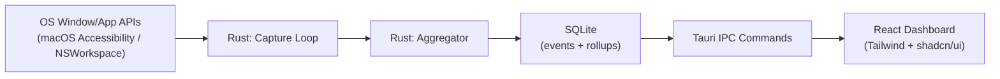

# Cadence — Master Plan

This is the single source of truth for what Cadence is, what the MVP includes, and what "done" looks like. When in doubt about scope, check here first.

---

## 1. Purpose

Cadence is a local-first developer telemetry dashboard. It observes how you actually work — active window time, IDE usage, keystroke cadence, commit activity — and turns that into a private, on-device picture of your focus and context-switching over a day.

**Why it exists:** most productivity/time trackers are cloud SaaS products that phone your activity home. Cadence is the opposite by design: everything is captured, aggregated, and stored on your machine, with no accounts and no network calls.

## 2. Problem Statement

Developers often can't answer basic questions about their own workday: *When am I actually focused? How often do I context-switch? Which hours are my most productive?* Existing tools either require a cloud account (privacy trade-off) or are too heavyweight/general-purpose (time trackers, RSI tools) for this narrow, dev-specific question.

## 3. Tech Stack

| Layer | Technology | Notes |
| --- | --- | --- |
| Desktop shell | Tauri v2 | Cross-platform packaging, native webview, small binary |
| Frontend | React + TypeScript + Tailwind CSS + shadcn/ui | Type-safe, minimal, fast to iterate |
| Backend | Rust | OS-level capture, aggregation, all business logic |
| Storage | SQLite (via Rust, e.g. `rusqlite`) | Single local file, no server |
| Tooling | Vite, ESLint/Prettier, Clippy/rustfmt | Enforced via `.cursor/rules/` |

No cloud services, no external APIs, no analytics SDKs — for the app itself or its build/dev tooling.

## 4. MVP Scope

The MVP proves the core loop: **capture → aggregate → visualize**, entirely on one machine, for a single day of data.

### In scope for MVP

- Tauri app shell that launches on macOS (primary dev target).
- Rust background capture of:
  - Active window title + owning app name
  - Duration spent per window/app
- Rust aggregation into rollups (time per app, focus session length, number of context switches).
- SQLite persistence of raw events + aggregated rollups.
- A single dashboard view (React) showing "today": time per app, a timeline of focus sessions, and a context-switch count.
- App can be started/stopped manually (no auto-launch requirement yet).

### Explicitly out of scope for MVP

- Keystroke frequency capture (privacy-sensitive, higher complexity — deferred to post-MVP).
- Commit-pattern tracking (git log correlation) — post-MVP.
- Multi-day history, trends, or comparisons — MVP is "today" only.
- Data pruning/archiving jobs.
- Export/import (CSV/JSON).
- Windows/Linux support — macOS only for MVP; cross-platform adapters come later.
- Auto-start on login, tray icon polish, notifications.

## 5. Functional Requirements

1. The app must run locally with zero network requests at runtime.
2. The Rust backend must poll or subscribe to OS-level "active window" changes and record `(app_name, window_title, start_ts, end_ts)` events.
3. Events must be persisted to a local SQLite file before being surfaced in the UI (UI reads from DB, not from live memory only).
4. The backend must derive, at minimum:
   - Total focused time per app for the current day
   - Number of context switches (app changes) for the current day
   - A list of focus sessions (contiguous time in one app above a minimum duration threshold)
5. The frontend must render this as a simple, readable dashboard without requiring any manual data entry.
6. No raw keystrokes or file contents are ever captured or stored — only window/app-level metadata.

## 6. Non-Functional Requirements

- **Privacy:** no data leaves the device under any circumstance. No telemetry about Cadence itself either.
- **Footprint:** background capture process should be lightweight — event-driven where the OS allows it, not a tight polling loop burning CPU.
- **Reliability:** a crash in the capture loop must not corrupt the SQLite file (use transactions).
- **Simplicity:** favor a single SQLite file and a single Rust crate structure over premature service/module splitting (see [`.cursor/rules/engineering-principles.mdc`](../.cursor/rules/engineering-principles.mdc)).

## 7. Architecture Overview



- **Capture loop** owns all OS interaction; nothing else touches OS APIs directly.
- **Aggregator** turns raw events into rollups on read (or on a periodic tick) — kept separate from capture so capture stays minimal and testable.
- **Tauri IPC commands** are the only bridge between Rust and React; the frontend never touches SQLite directly.

## 8. Data Model (MVP sketch)

```sql
-- raw capture events
CREATE TABLE window_events (
    id INTEGER PRIMARY KEY,
    app_name TEXT NOT NULL,
    window_title TEXT,
    started_at INTEGER NOT NULL,  -- unix ms
    ended_at INTEGER              -- unix ms, null while ongoing
);

-- derived, per-day rollups (recomputed from window_events)
CREATE TABLE daily_app_totals (
    date TEXT NOT NULL,           -- YYYY-MM-DD
    app_name TEXT NOT NULL,
    total_focused_ms INTEGER NOT NULL,
    PRIMARY KEY (date, app_name)
);
```

Schema will evolve; this is a starting point, not a contract.

## 9. Milestones

These milestones are broken into standalone slice docs, each with its own scope, tasks, and definition of done. Work through them in order:

1. [`plan-01-scaffold.md`](plan-01-scaffold.md) — Tauri v2 + React + TS + Tailwind + shadcn boots to a blank window.
2. [`plan-02-capture-and-persistence.md`](plan-02-capture-and-persistence.md) — Rust capture loop records active window changes into SQLite.
3. [`plan-03-aggregation-engine.md`](plan-03-aggregation-engine.md) — compute daily app totals, focus sessions, and context-switch count from stored events.
4. [`plan-04-dashboard-ui.md`](plan-04-dashboard-ui.md) — dashboard renders today's totals and a focus-session timeline via Tauri IPC.
5. [`plan-05-polish-and-hardening.md`](plan-05-polish-and-hardening.md) — start/stop control, error handling, lint pass, MVP sign-off.

Each slice should be its own set of small commits, and ideally its own PR/branch even for a solo project — keeps history reviewable.

## 10. Success Criteria (Definition of Done for MVP)

- Running the app for a real work session produces an accurate, sensible "today" dashboard.
- No network activity occurs at any point (verifiable via OS network monitor).
- No raw keystrokes/content ever appear in the SQLite file.
- Code passes `cargo clippy -D warnings` and the frontend lints cleanly.

## 11. Post-MVP Roadmap

Tracked in [`README.md`](../README.md#roadmap):

- Keystroke frequency (aggregated, not raw)
- Commit-pattern tracking
- Multi-day history & trends
- Data pruning/archiving
- Export/import (CSV/JSON)
- Windows/Linux support
